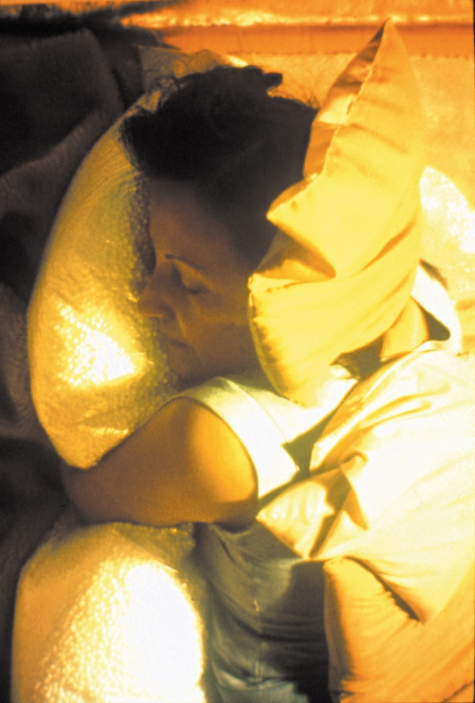

the inside is the outside

Structuring of the Self  
as proposed by Lygia Clark (Brazil, 1920-1988)  

how is the session setting?
---------------------------

The participant is invited to lie down (or find another comfortable position to stay in).

I place the Relational Objects on their body.  The participant remains in contact with the Relational Objects for most of the session. Then the objects are moved and removed.

We have a moment to integrate the experience at the end.

Examples of Relational Objects are: small cushions with fine sand, plastic bags with water or air, bags of stone and air (named breathe with me), ventilation tubes, loofah rolls, big styrofoam ball cushions, stones, seashells.

  
  

how it may serve you
--------------------

Structuring of the Self can serve to reactivate a fruition skill or a quality of aesthetic experience.

Processes of violence, oppression and everyday demands make our bodies produce hard carapaces.  By practising opening up these carapaces, we open up ways of contact both inside-out and outside-in.

With the use of Relational Objects, a setting is created in which one can experience an openness to letting themselves be affected by "external forces". These "external forces" are in the memory of the participant's body already. 

The proposition can facilitate the access to tides and memories that are prior to speech and reasoning/ rationalisation.  In this sense, it may generate valuable associations that can be taken to the talking therapy or the psychoanalytic classical setting.

The objects activated during Structuring of the Self have no symbolic charge in themselves and, in contact with the body, serve as points of support, expansion, dilution, filling, etc.

It may facilitate access to living spaces and bodies with which we have had contact and are understood as 'past' memories. When these memories are experienced in their embodied presence, we may find/create new ways to integrate them.

Structuring of the Self might help counterflow dissociation experience by making it easier to experience the body with its weights, textures and edges during an extended period of time.

The session can be a way of relaxing and resting in a germinative way.

who
---

I'm Ta'wa, an artist/cultural worker from Taguatinga-DF/Brazil, currently living in London/UK.

I've been researching Lygia Clark's Structuring of the Self since 2011. 

I approach this proposition and the uses of relational objects as a social practice, in intersection with the instauration of abolition geographies and collective liberation processes.

I had investigated the impact of a consistent implementation of Structuring of the Self  within a psychiatric hospital ward, aiming to erode spaces and practices of imprisonment and alienation. Additionally, I had explored the origins of the Structuring of the Self  proposition, particularly as it relates to Lygia's conviviality with sex workers. More recently, I've also been looking at how the objects serve as bridges to access the body and its memories - with the aim to open our resonating capacity, connecting with being beyond ourselves – a practice in tune with the principles of Buen Vivir from the cosmovisions of Quechua, Aymara and Guarani Peoples from Abya Yala. 

where
-----

The sessions take place in South East London - UK

The current location does not offer step-free access, but accommodations are possible, such as home-visits.

bookings and enquiries via email
--------------------------------

[theinsideistheoutside@gmail.com](mailto:theinsideistheoutside@gmail.com)

prices
------

| what                  | how much |
| --------------------- | -------- |
| single 1h-session     | 30£      |
| 4 or more 1h-sessions | 25£ each |
